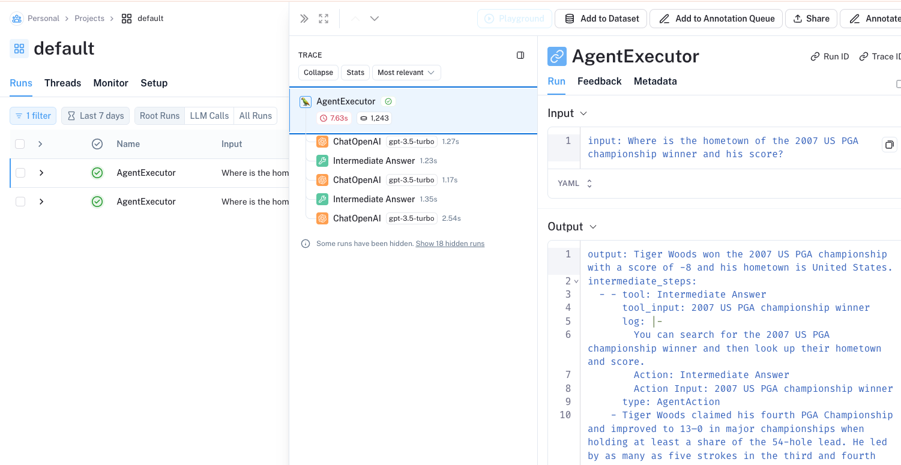

# LangSmith를 이용한 Langchain agent 내부 동작 구조 이해

앞의 예제는 agent를 생성할때 initialize_agent를 사용하는 방식으로 Langchain 0.1.0 까지는 지원하지만 deplicate 될 예정이고 새 버전의 create_react_agent 함수를 사용하기를 권장하고 있다.

create_react_agent를 사용하려면 직접 agentExecutor도 선언해야 하고, 프롬프트도 정의해야하기 때문에 기존 방식에 비해서 다소 번거롭지만 좀 더 많은 컨트롤을 할 수 있다.

이번에는 create_react_agent를 이용하는 방식을 설명하면서 내부적으로 agent가 어떻게 동작하는지를 자세하게 살펴보고, 더불어서 langsmith 모니터링 툴을 이용하여, agent에서 내부의 동작을 어떻게 모니터링하고 추적하는지에 대해서 알아보록 한다.

## Langsmith 등록

langsmith는 langchain에서 만든 온라인 기반의 LLM 애플리케이션 모니터링, 테스트 지원, 배포 지원 도구이다.

상세한 내용은 별도의 챕터에서 따로 설명하도록 하고, 이번 챕터에서는 모니터링 트레이스 기능을 간단하게 살펴본다. 

Agent에서 분기가 어떻게 이루어지고, Agent가 어떤 구조로 판단을 하는지를 상세하게 모니터링할 수 있다.

Langsmith를 사용하기 위해서는 사이트에 가입을 해야 한다. https://www.langchain.com/langsmith

가입을 한후 대시보드로 들어가면, 좌측 메뉴에 Project 메뉴가 있다. 메뉴로 들어가서 우측의 “New Project”로 새로운 프로젝트를 생성한다.

그리고 여기서 API KEY 를 가지고 오면 된다. 

## Langsmith 를 이용한 예제 코드 

예제코드를 살펴보자. 예제코드의 앞부분은 앞의 예제와 거의 동일하다.

LANGCHAIN 관련 환경 변수를 세팅해준다

LANGCHAIN_API_KEY는 앞에서 langsmith 콘솔에서 생성한 APIKEY를 사용하고, LANGCHAIN_PROJECT는 앞에서 생성한 langsmith의 프로젝트명을 사용한다.

```python
from langchain.llms.openai import OpenAI
from langchain.utilities import GoogleSerperAPIWrapper
from langchain.agents import initialize_agent, Tool
from langchain.agents import AgentType
from langchain_core.prompts import PromptTemplate
from langchain.agents import AgentExecutor, create_react_agent
from langchain.chat_models import ChatOpenAI

load_dotenv(override=True)

model = ChatOpenAI(temperature=0.1) 

google_search = GoogleSerperAPIWrapper()
tools = [
    Tool(
        name="Intermediate Answer",
        func=google_search.run,
        description="useful for when you need to ask with search",
        verbose=True
    )
]

template = '''Answer the following questions as best you can. You have access to the following tools:

{tools}

Use the following format:

Question: the input question you must answer
Thought: you should always think about what to do
Action: the action to take, should be one of [{tool_names}]
Action Input: the input to the action
Observation: the result of the action
... (this Thought/Action/Action Input/Observation can repeat N times)
Thought: I now know the final answer
Final Answer: the final answer to the original input question

Begin!

Question: {input}
Thought:{agent_scratchpad}'''

prompt = PromptTemplate.from_template(template)

search_agent = create_react_agent(model,tools,prompt)
agent_executor = AgentExecutor(
    agent=search_agent,
    tools=tools,
    verbose=True,
    return_intermediate_steps=True,
)
response = agent_executor.invoke({"input": "Where is the hometown of the 2007 US PGA championship winner and his score?"})

print(response)
```

이전 버전의 initializ_agent 메서드와는 다르게 create_react_agent에서는 Agent가 사용할 프롬프트를 직접 정의해줘야 한다.  Agent용 프롬프트는 Langchain 페이지에서 샘플 프롬프트를 얻을 수 있다.
- https://api.python.langchain.com/en/latest/agents/langchain.agents.react.agent.create_react_agent.html

이 프롬프트에 인자로 전달해야 하는 변수는 다음과 같다.
- tools : tool에 대한 설명으로, tool에 대한 description과 각 tool에 대한 입력변수와 그에 대한 설명이 들어간다.
- input : agent로 입력되는 질문
- tools_name : agent가 사용할 수 있는 tool 들의 이름
- agent_scratchpad : agent는 원하는 답을 얻기 위해서 tool을 한번만 호출하는 것이 아니라, 원하는 답을 얻을때까지 tool들을 반복 호출하는 구조를 갖는다. Tool 을 호출할때 마다 이전 호출이 어땠는지, 이전 호출에 대한 정보와 결과값을 이 필드에 저장한다.


프롬프트의 변수값들은 자동으로 채워지기때문에, 수정할 곳은 없다. 프롬프트 역시 이미 작성된 예제를 그대로 사용하면 된다. 단지 agent의 성능을 개선하고 싶은 경우에는 이 프롬프트를 수정하면 된다.

프롬프트에는 agent의 동작 메커니즘을 가이드 하고 있다. 

```text
Thought: you should always think about what to do
Action: the action to take, should be one of [{tool_names}]
Action Input: the input to the action
Observation: the result of the action
... (this Thought/Action/Action Input/Observation can repeat N times)
```

Thought 단계에서 agent가 llm을 이용하여, 질문에 대한 답을 얻기 위해서 어떤 action을 해야 하는지를 생각하게 하고, Action은 어떤 tool을 사용할지를 결정하게 된다. 

그리고 Action Input은 tool에 질의한 새로운 질문이 생성된다. 그리고 마지막으로 Observation은 Action에 의해서 호출된 tool에 결과를 저장하게 된다.

이 순서를 통해서 Agent는 [Thought → Action → Action Input → Observation] 을 실행하고 결과를 agent_scratchpad에 저장한후 이 과정을 원하는 답변을 얻을 때 까지 반복한다.

프롬프트를 생성하였으면, 이 프롬프트를 이용하여 agent를 생성하고, 이 agent를 이용하여 agent executor를 생성하여 호출한다.

agent가 들어온 질문에 대해서 판단을 하고 tool을 실행 한다면, 이 과정을 답변을 얻을때까지 반복적으로 agent를 실행해줄 주체가 필요한데, agent executor가 이 역할을 한다.

## Agent 실행 상세 구조

이 실행 구조를 그림으로 도식화해보자. 


질문 (Question) 이 들어오, 앞에서 생성한 agent용 프롬프트(Agent prompt)에 이 질문을 삽입하여 agent에 전달한다.

Agent는 질문 (Question)에 대한 답을 내기 위해서 agent용 프롬프트(Agent prompt)의 가이드를 참고하고, Thought 과정을 통해서 필요한 질문(Question 1 : Action Input에 해당한다. )을 생성한다.

질문을 선택한 Tool (Action에 해당함)을 호출하여 답변 (Answer 1: Observation에 해당함)을 받은 후 답변을 기존 agent용 프롬프트 (Agent prompt)의 agent_scratchpad 에 append 한다

이 agent용 프롬프트를 agent executor가 다시 agent에 전달을 하고, 같은 순서로 question 2를 생성하고, 이에 대한 답변 answer2 를 받은 후, 마찬가지로 기존 agent용 프롬프트에 append한다.

다시 이 프롬프트를 agent_executor가 agent에 전달하면 만약에 답변에 필요한 정보가 충분히 수집 되었을 경우 agent는 프롬프트에 있는 정보를 바탕으로 답변을 생성하여 최종 답변 (Final Answer)를 생성하여 리턴한다.

## Langsmith 를 통한 호출 과정 이해 

동작 원리에 대한 개념을 이해 하였으면,  이 예제에서 agent가 어떤 과정을 통해서 답변을 도출했는지를 langsmith를 통해서 살펴보자.

langsmith 콘솔에 접속한 후에 좌측에 프로젝트 메뉴로 들어간다.

그러면 Agnet 의 호출 흐름에 대해서 볼 수 있음. 



